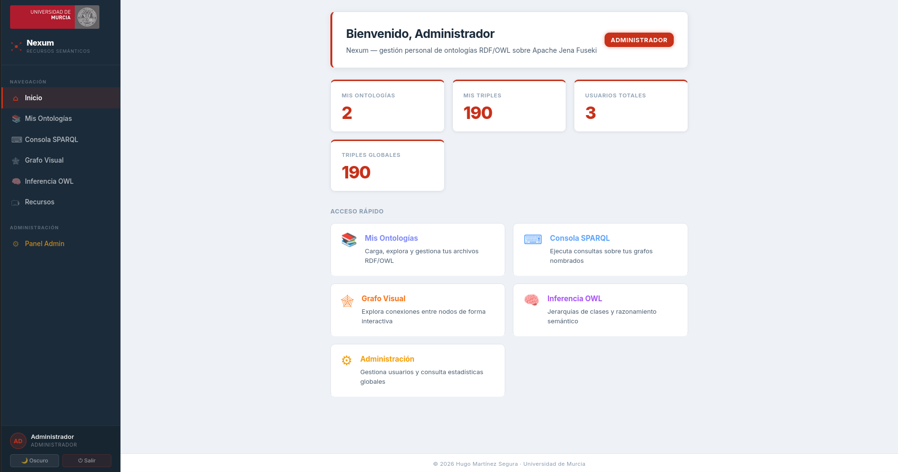
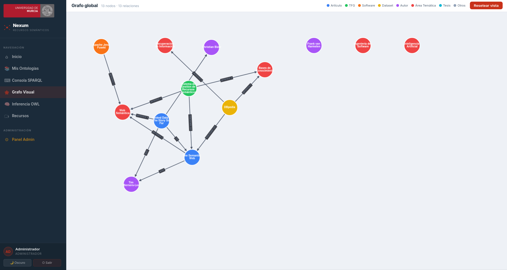
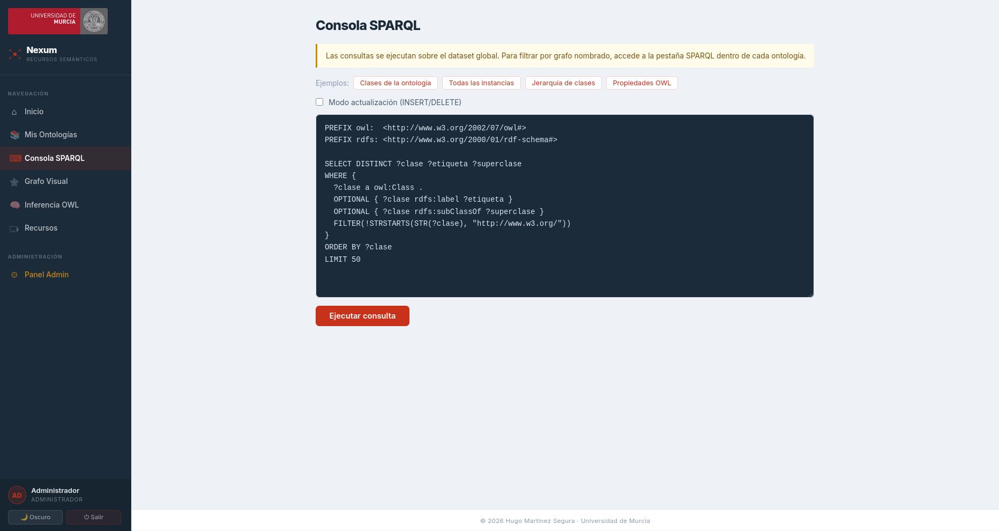
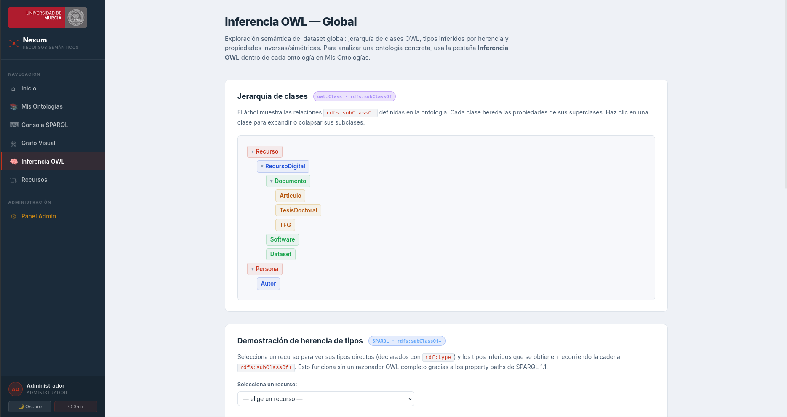
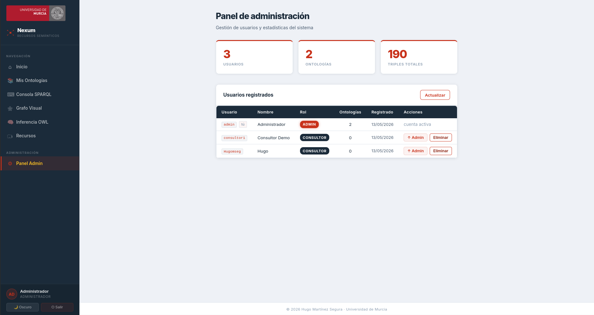

<div align="center">


<br/>

**Carga una ontología, explora el grafo y deja que el razonador haga su magia.**

[](https://react.dev)
[](https://vitejs.dev)
[](https://nodejs.org)
[](https://docker.com)
[](https://jena.apache.org/documentation/fuseki2/)
[](https://jwt.io)

<br/>



</div>

---

## ¿Qué es Nexum?

Nexum es una aplicación web para gestionar y explorar **ontologías RDF/OWL** sobre Apache Jena Fuseki. Subes tus archivos `.ttl` o `.owl`, navegas por el grafo de conocimiento de forma interactiva, lanzas consultas SPARQL y ves en tiempo real qué relaciones infiere el razonador OWL — incluso las que no declaraste explícitamente.

Nació como TFG en la Universidad de Murcia, pero está pensado para que cualquiera pueda clonarlo, cargarlo con sus datos y ponerse a explorar sin tocar una sola línea de configuración.

---

## Características

- 🗂️ **Ontologías propias** — sube archivos RDF/OWL/Turtle y cada uno queda en su grafo nombrado privado en Fuseki
- 🕸️ **Grafo visual interactivo** — explora nodos y aristas con Cytoscape.js, con filtros por tipo de recurso
- 💬 **Consola SPARQL** — escribe y ejecuta SELECT, ASK, DESCRIBE o CONSTRUCT directamente sobre el triple store
- 🧠 **Inferencia OWL** — el razonador deduce relaciones implícitas; tú defines la ontología, él saca conclusiones
- 🔐 **Dos roles** — administrador con acceso completo y consultor en modo solo lectura
- 🌙 **Tema claro/oscuro** — porque hay que tener ciertas prioridades

---

## Vistas

<table>
  <tr>
    <td align="center"><b>Grafo visual</b></td>
    <td align="center"><b>Consola SPARQL</b></td>
  </tr>
  <tr>
    <td></td>
    <td></td>
  </tr>
  <tr>
    <td align="center"><b>Inferencia OWL</b></td>
    <td align="center"><b>Panel de administración</b></td>
  </tr>
  <tr>
    <td></td>
    <td></td>
  </tr>
</table>

---

## Stack

| Capa | Tecnología |
|------|-----------|
| Frontend | React 18 + Vite |
| Backend | Node.js + Express |
| Triple store | Apache Jena Fuseki 4.x (razonador OWL) |
| Autenticación | JWT + bcrypt |
| Contenedores | Docker + Docker Compose |

---

## Recomendaciones para el desarrollo

Los comentarios del código usan la extensión [**Better Comments**](https://marketplace.visualstudio.com/items?itemName=aaron-bond.better-comments) para VS Code. Se recomienda tenerla instalada para ver los comentarios con colores según su tipo.

---

## Arrancar

Solo necesitas **Docker**. Nada más que instalar.

```bash
git clone https://github.com/hmxnz/Nexum
cd nexum
docker-compose up --build
```

La primera vez descarga las imágenes base; paciencia. Una vez arrancado:

| Servicio | URL |
|----------|-----|
| App | http://localhost:5173 |
| API | http://localhost:4000/api/health |
| Fuseki | http://localhost:3030 |

```bash
docker-compose down        # parar
docker-compose down -v     # parar y borrar datos de Fuseki
```

---

## Usuarios de demo

| Usuario | Contraseña | Rol |
|---------|-----------|-----|
| `admin` | `admin123` | Administrador |
| `consultor1` | `consultor123` | Consultor |

---

<div align="center">

Hugo Martínez Segura · Grado en Gestión de Información y Contenidos Digitales · Universidad de Murcia · 2026

</div>
